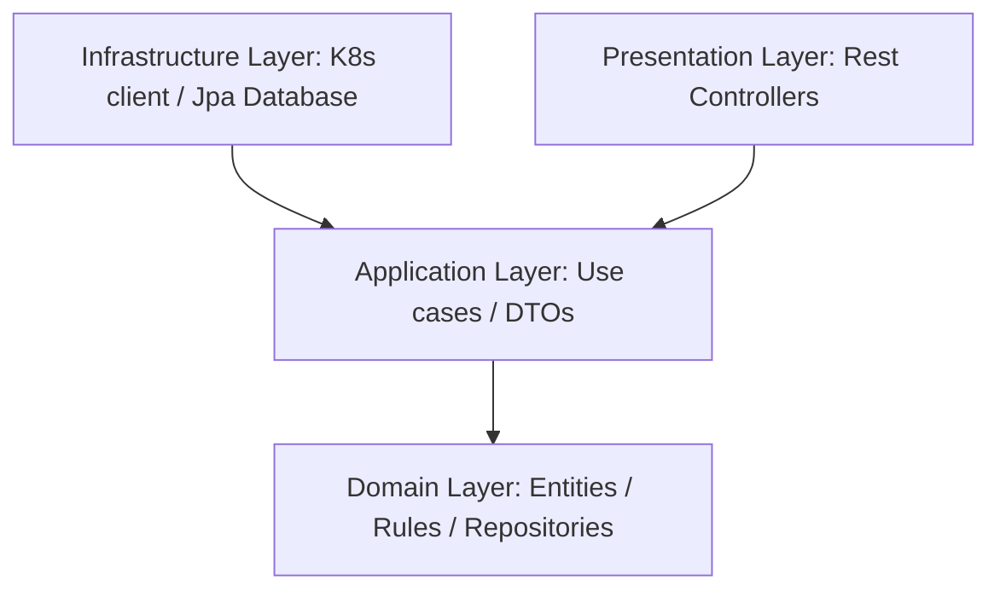

# Application Architecture - Kubernetes Cost Optimizer

This document provides a technical overview of the design patterns, architectural boundaries, and data flow of the **Kubernetes Cost Optimizer** application.

---

## Clean Architecture Principles

The codebase strictly adheres to **Clean Architecture** (Robert C. Martin). The core guiding rule is the **Dependency Rule**: *Source code dependencies must point only inwards, toward the domain.*



### Purpose of Each Layer

1. **Domain Layer (`com.k8s.costoptimizer.domain`)**
   - **Entities**: Core business objects (`Recommendation`, `ClusterMetrics`, `NodeResourceInfo`, `PodResourceInfo`) that model Kubernetes concepts and cost evaluations.
   - **Service / Heuristics**: Pure algorithms (`CostOptimizationEngine`, rules strategy) calculating cost differentials and waste.
   - **Repository Ports**: Structural interface definitions (`ClusterRepository`, `RecommendationRepository`) that application flows use. This layer has **no dependencies** on Spring Boot, Jackson, Hibernate, or the Kubernetes API libraries.
   
2. **Application Layer (`com.k8s.costoptimizer.application`)**
   - **Use Cases**: Services (`ClusterAnalysisUseCase`, `RecommendationUseCase`, `AuthUseCase`) which coordinate operations: retrieving data from adapters, running optimization rules, and storing them in databases.
   - **DTOs / Contracts**: API request/response models (`ClusterOverviewResponse`, `AuthRequest`) to decouple domain boundaries.
   
3. **Infrastructure Layer (`com.k8s.costoptimizer.infrastructure`)**
   - **Persistence**: Contains the JPA entities (`RecommendationEntity`, `UserEntity`), Spring Data JPA repositories, and repository adapters mapping domain boundaries to PostgreSQL.
   - **Kubernetes Client**: Concrete adapter (`KubernetesClientAdapter`) wrapping the official Java client to contact the API and query Metrics Server.
   - **Security**: Security context, filters, and providers mapping JWT keys.

4. **Presentation Layer (`com.k8s.costoptimizer.presentation`)**
   - **REST Controllers**: Expose web routes (`/api/v1/...`) using Spring Web REST controller tags.
   - **Exception Mapping**: Global advices mapping system faults to JSON error shapes.

---

## Directory Structure

```text
c:\6th sem\kubernetes cost optimiser\
├── backend/
│   ├── src/
│   │   ├── main/
│   │   │   ├── java/com/k8s/costoptimizer/
│   │   │   │   ├── domain/               <-- Pure business concepts & logic
│   │   │   │   │   ├── model/
│   │   │   │   │   ├── repository/
│   │   │   │   │   └── service/
│   │   │   │   ├── application/          <-- Use case orchestration & DTO boundary
│   │   │   │   │   ├── dto/
│   │   │   │   │   └── service/
│   │   │   │   ├── infrastructure/       <-- DB adapters, K8s api client, JWT security
│   │   │   │   │   ├── kubernetes/
│   │   │   │   │   ├── persistence/
│   │   │   │   │   └── security/
│   │   │   │   ├── presentation/         <-- Rest Controllers & Global Advice handlers
│   │   │   │   │   ├── controller/
│   │   │   │   │   └── exception/
│   │   │   │   └── config/               <-- Bean wiring definitions
│   │   │   └── resources/                <-- Config properties & profiles
│   │   └── test/                         <-- Unit & integration tests
│   └── Dockerfile
│
├── frontend/
│   ├── src/
│   │   ├── components/                   <-- Shared dashboard layout & menus
│   │   ├── context/                      <-- Auth provider contexts
│   │   ├── pages/                        <-- Analytics, dashboard tables & login UI
│   │   ├── services/                     <-- Axios API client interceptor functions
│   │   ├── App.tsx                       <-- Route maps & providers
│   │   └── theme.ts                      <-- Dark/Light Material UI styles
│   └── Dockerfile
│
├── k8s/                                  <-- Pod deployment & RBAC manifests
└── docker-compose.yml                    <-- Multi-container environment local definitions
```

---

## Request & Data Flow

When a user visits the dashboard:
1. **Frontend Request**: React mounts and uses React Query to call `/api/v1/cluster/overview`.
2. **REST Interception**: `JwtAuthenticationFilter` validates token, setting context.
3. **Controller Handling**: `ClusterController` receives the request and triggers `ClusterAnalysisUseCase.getClusterOverview()`.
4. **Data Retrieval**: `ClusterAnalysisUseCase` calls `ClusterRepository.getPods()` and `getNodes()`.
5. **Adapter Implementation**: `KubernetesClientAdapter` translates these port requests, calling the Kubernetes CoreV1 and CustomObjects API endpoints, returning Domain models.
6. **Domain Evaluation**: The Use Case feeds this data to `CostOptimizationEngine` rules, which calculate cost-saving recommendations.
7. **Persistence Saving**: Use case merges state, updating `RecommendationRepositoryAdapter` Jpa mappings.
8. **JSON Response**: Controller formats the calculated variables into `ClusterOverviewResponse` DTO, returning `200 OK` JSON to the frontend.
9. **UI Rendering**: Recharts draws graphs, table maps nodes, and gauges update.
